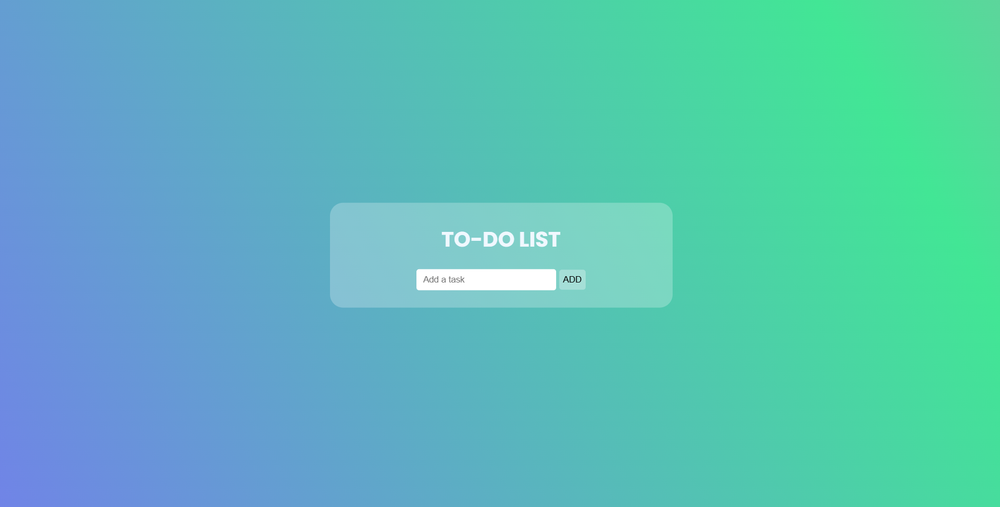
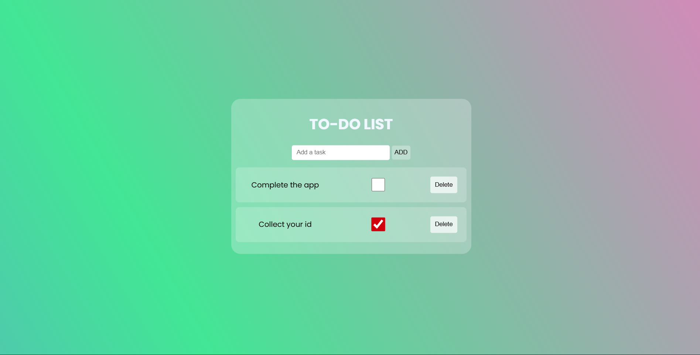

# 📝 To-Do List App

A simple and responsive To-Do List application to manage daily tasks efficiently.  
Built with **[your tech stack – e.g., HTML, CSS, JavaScript / React / etc.]**.  

---

## 🚀 Features
- Add, edit, and delete tasks. 
- Mark tasks as completed.
- Responsive design for all devices.  
- Stores tasks locally (optional: LocalStorage/Database).  

---

## 📸 Screenshots

### Home Page  


### Adding a Task  


---

## ⚙️ Installation
1. Clone the repo  
   ```bash
   git clone https://github.com/your-username/todo-list.git

2. Open the folder 
   ```bash
   cd todo-list

3. Run the app (depending on your stack, e.g., open index.html or npm start)

## 💡 Ussage

- Type your task in the input box.

- Click Add to save the task.

- Check it off when done ✅.

## 🤝 Contributing

- Pull requests are welcome. For major changes, please open an issue first.


   
